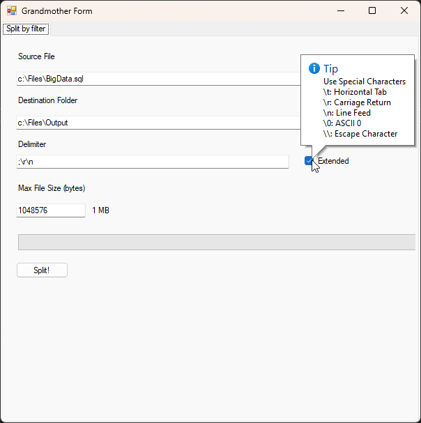

# Split LargeText Files

This application aims to split large text files into smaller chunks without corrupting their content. 

For example, if you have a large SQL file, you may want to split it into smaller files. However, you do not want the SQL statements to be split incorrectly and become corrupted.

With this application, you can specify a delimiter such as `;\r\n` (or `;\n` for Linux) to split the SQL statements at the end of a line, ensuring that each chunk contains complete SQL statements.

